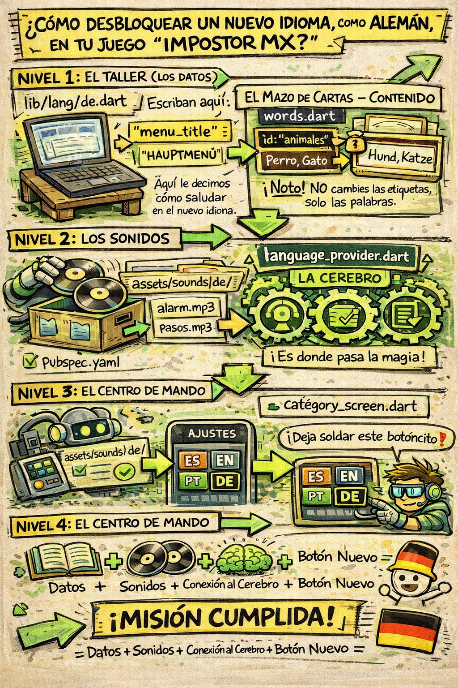

Si a futuro decides agregar Alemán (de) o Chino (zh) etc, esta guía de 5 pasos te ayudará a entender como lograrlo:

___________________

1. El Diccionario (Textos de la Interfaz)
 * Crea un nuevo archivo en tu carpeta lib/lang/, por ejemplo de.dart (usando siempre el estándar ISO de dos letras). [Ver Lista](ISO3166-1alfa-2.md)
 * Copia la estructura exacta de en.dart.
 * Traduce los valores del mapa (la parte derecha de los dos puntos) y la lista de castigos por defecto. Las claves (la parte izquierda, como menu_title) deben quedar estrictamente intactas.
2. Las Cartas de Juego (words.dart)
 * Abre tu archivo lib/words.dart.
 * Clona una de las listas de categorías (como _categoriesEn) y renómbrala a _categoriesDe.
 * Traduce la propiedad name y las listas de words de cada categoría.
 * Regla de oro: Jamás cambies el valor id de las categorías. Si la categoría es de películas, el id debe seguir siendo cine en alemán, chino o ruso. Esto garantiza que el juego no se rompa si el usuario cambia de idioma a mitad de una partida.
 * Sube a la función getGameCategories y agrega el nuevo caso al switch:
   case 'de': return _categoriesDe;
3. El Motor Principal (language_provider.dart)
 * Importa tu nuevo diccionario en la parte superior: import '../lang/de.dart';
 * Añade la nueva variable al mapa _dictionaries: 'de': de,
 * Añade la nueva lista al mapa _defaultPunishments: 'de': defaultPunishmentsDe,
4. Los Archivos de Audio y Assets
 * Ve a tus carpetas físicas y crea assets/sounds/de/.
 * Guarda ahí los audios grabados en ese idioma, nombrados exactamente igual: alarm.mp3 y pasos.mp3.
 * Abre tu archivo pubspec.yaml y registra la nueva ruta en la sección de assets para que Flutter la empaquete al compilar: - assets/sounds/de/
5. El Botón en la Interfaz (category_screen.dart)
 * Abre la pantalla principal.
 * Busca la sección _showSettingsModal (donde pusimos la fila con los botones ES, EN, PT).
 * Agrega un nuevo widget _LangButton copiando uno existente y cambiando los valores para que apunte a 'de'.
